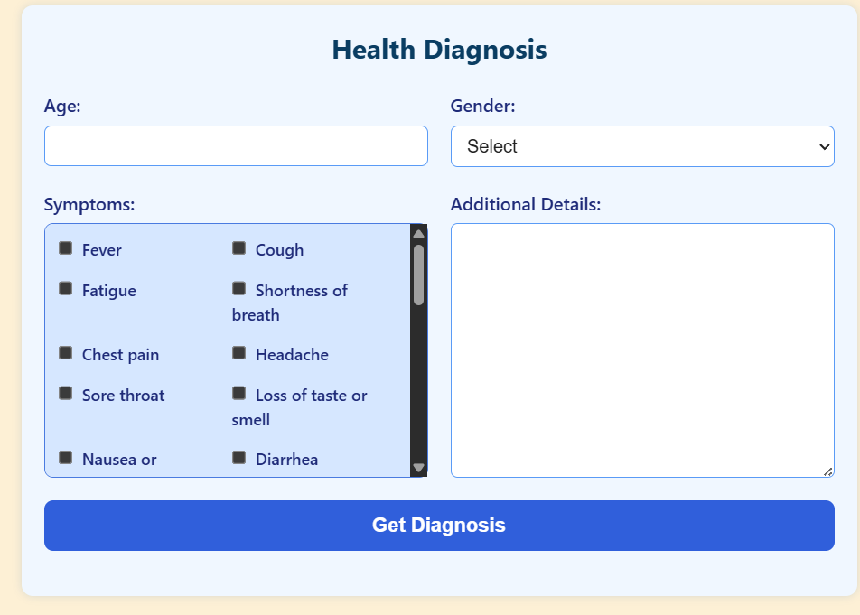

# HealthBoat

## Overview

HealthBoat is a user-friendly healthcare web application designed to provide early diagnosis assistance and mental health support. It allows users to input symptoms, receive possible diagnoses, and access relevant health resources — all in a clean, intuitive interface.

---

## Features

- **Symptom Input:** Users can select from a list of symptoms to describe their condition.
- **Early Diagnosis:** Based on the input, the app provides possible diagnoses with explanations.
- **Mental Health Support:** Includes a chatbot and mental health resources tailored by age and gender.
- **Responsive Design:** Works smoothly on desktop and mobile devices.
- **Custom UI Elements:** Includes a custom cursor and polished, accessible form components.

---

## Tech Stack

- React.js (frontend)
- Vite (build tool)
- Tailwind CSS (styling)
- Optional: Backend API for advanced diagnosis (if applicable)

---

## Getting Started

### Prerequisites

- Node.js (version 16 or later recommended)
- npm or yarn package manager

### Installation

1. Clone the repo:

   ```bash
   git clone https://github.com/your-username/healthboat.git
   cd healthboat

2. Install Dependencies
    ```bash
    npm install
    # or
    yarn install

3. Run the development server:
    ```bash
    npm run dev
    # or
    yarn dev    





